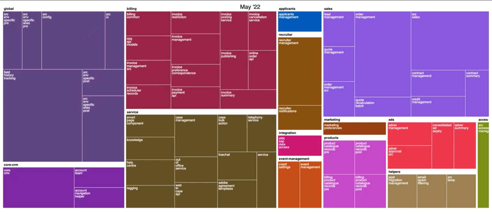

# Flxblviz (formerly DX@Scale viz)

A cli tool to generate an animation showing the evolution of packages
in a Salesforce DX project.

This was used to illustrate the Dreamforce 2022 presentation:
[Composability and Packaging at Scale for Architects](https://www.salesforce.com/plus/experience/Dreamforce_2022/series/Architects/episode/episode-s1e7).

An example output can be seen at https://www.youtube.com/watch?v=0cL0rBXe1lg




## Usage

```
Usage:
    flxblviz [--repository REPO] [--output OUTPUT] [--domains DOMAINS]
Options
    -r, --repository REPO  Path to the git repository containing the project
    -o, --output OUTPUT    Path to the outputfile
    -d, --domains DOMAINS  Path to the domains.json file
    --help                 Display this message

REPO defaults to the current directory, and OUTPUT defaults to standard output.
If OUTPUT exists, it will be overwritten.

DOMAINS is the path to a json file containing mapping between the packages
and their domain. The json file must contain only one object whose keys are the
package names and a string value representing the domain name.

    {
        "my-package": "domain1",
        "another-package": "my-other-domain"
    }

Example:
    $ flxblviz -o index.html
    $ flxblvix -r path/to/repo
```
